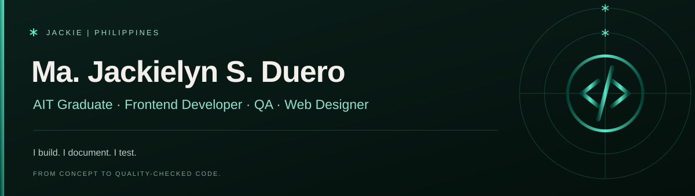
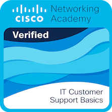
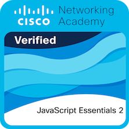

  

Sup! I am a Developer with a soft spot for clean, polished UI — currently looking for a job while continuously being active in coding and even designing.

- ✨ Recently completed the Degree in **Aviation Information Technology**, now focused on web development
- 🛠️ Comfortable across **React/Vite, Bootstrap 5, Framer Motion, CSS Modules, Laravel, ASP.NET Core MVC**
- 🎯 Currently looking for a job where I can apply my skills.
- 🧩 I like simple, clean solutions over overengineered ones.
- 💻 Check out my [Portfolio](https://majackielynduero-portfolio.site) for more of my work.
- 📚 Always learning — every bug fixed is a lesson learned.
   

## Tools and Technologies

  
  
  
  
  
  
  
  
  
  
  
  
  
  
  
  
  
  
  
  
  

 

## Skills

| Category                | Skills                       |
| ----------------------- | ---------------------------- |
| **💻 Technical Skills** | System Integration Testing   |
|                         | Quality Control              |
|                         | Defect Documentation         |
|                         | UI/UX Validation             |
|                         | MVC Architecture             |
|                         | SOLID Principles             |
|                         | DRY Practices                |
|                         | Agile Methodology            |
|                         | Database Design              |
|                         | Business Rules Documentation |
|                         | User Manual Creation         |
| **🤝 Soft Skills**      | Adaptable                    |
|                         | Responsible                  |
|                         | Growth Oriented              |
|                         | Detail Oriented              |
|                         | Cross Functional             |
|                         | Reliable                     |
|                         | Willingness to Learn         |
|                         | Coachable                    |

 

## Badges and Certifications

  
  
  
  
  

 
